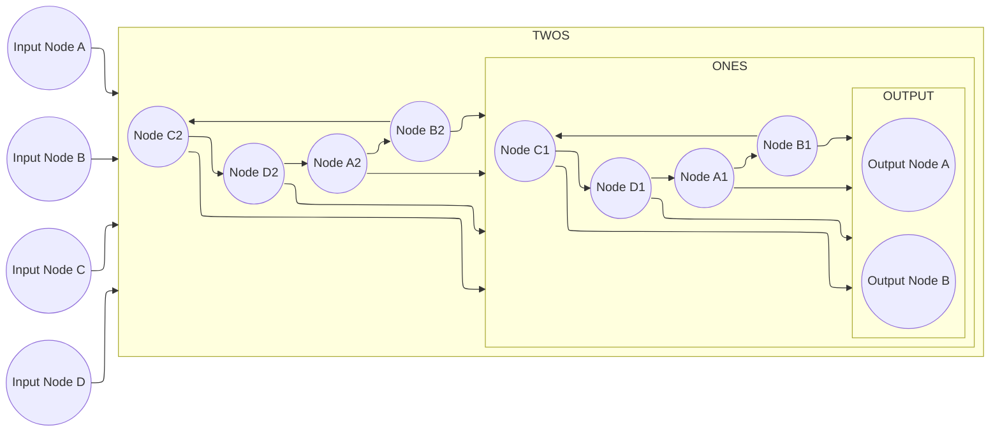

# ArcI: Circular Intelligence

```mermaid
%%{init: {"flowchart": {"defaultRenderer": "elk"}} }%%
flowchart LR;
    subgraph TWOS;
        subgraph ONES;
            idA1((Node A1))-->idB1((Node B1));
            idB1-->idC1((Node C1));
            idC1-->idD1((Node D1));
            idD1-->idA1;

            idA1-->OUTPUT;
            idB1-->OUTPUT;
            idC1-->OUTPUT;
            idD1-->OUTPUT;
            subgraph OUTPUT;
                idE((Output Node A));
                idF((Output Node B));
            end
        end

        idA2((Node A2))-->idB2((Node B2));
        idB2-->idC2((Node C2));
        idC2-->idD2((Node D2));
        idD2-->idA2;

        idA2 --> ONES;
        idB2 --> ONES;
        idC2 --> ONES;
        idD2 --> ONES;
    end

    idIA((Input Node A)) --> TWOS;
    idIB((Input Node B)) --> TWOS;
    idIC((Input Node C)) --> TWOS;
    idID((Input Node D)) --> TWOS;

```

Number of dimensions: $x(2n+3)$ where $n$ is the number of weights for each node(varies per node) and $x$ is the number of nodes
